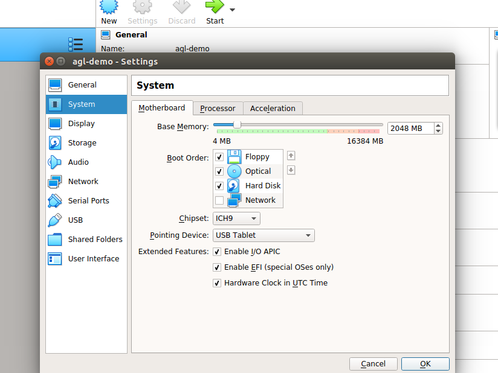

AGL provides a number of pre-built ready-made images of various versions.

## x86 (Emulation and Hardware)

### 1. QEMU (Emulation)

1. Download the [compressed prebuilt image](https://download.automotivelinux.org/AGL/snapshots/master/latest/qemux86-64/deploy/images/qemux86-64/agl-demo-platform-crosssdk-qemux86-64.ext4.xz).

2. Download the [compressed kernel image](https://download.automotivelinux.org/AGL/snapshots/master/latest/qemux86-64/deploy/images/qemux86-64/bzImage).

3. Install [QEMU](https://www.qemu.org/download/) :

    ```sh
    $ apt-get install qemu
    ```

4. Install [vinagre](https://wiki.gnome.org/Apps/Vinagre) :

    ```sh
    $ sudo apt install vinagre
    ```

5. Create boot directory and copy compressed images (prebuilt & kernel) into them :

    ```sh
    $ mkdir ~/agl-demo/
    $ cp ~/Downloads/agl-demo-platform-crosssdk-qemux86-64.ext4.xz ~/agl-demo/
    $ cp ~/Downloads/bzImage ~/agl-demo/
    $ cd ~/agl-demo
    $ sync
    ```

6. Extract prebuilt compressed image :

    ```sh
    $ xz -v -d agl-demo-platform-crosssdk-qemux86-64.ext4.xz
    ```

7. Launch QEMU with vinagre (for scaling), remove `- snapshot \` if you want to save changes to the image files :

  ```sh
    $ ( sleep 5 && vinagre --vnc-scale localhost ) > /tmp/vinagre.log 2>&1 &
      qemu-system-x86_64 -device virtio-net-pci,netdev=net0,mac=52:54:00:12:35:02 -netdev user,id=net0,hostfwd=tcp::2222-:22 \
      -drive file=agl-demo-platform-crosssdk-qemux86-64.ext4,if=virtio,format=raw -show-cursor -usb -usbdevice tablet -device virtio-rng-pci \
      -snapshot -vga virtio \
      -vnc :0 -soundhw hda -machine q35 -cpu kvm64 -cpu qemu64,+ssse3,+sse4.1,+sse4.2,+popcnt -enable-kvm \
      -m 2048 -serial mon:vc -serial mon:stdio -serial null -kernel bzImage \
      -append 'root=/dev/vda rw console=tty0 mem=2048M ip=dhcp oprofile.timer=1 console=ttyS0,115200n8 verbose fstab=no'
  ```

  - Login into AGL :

    ```sh
    Automotive Grade Linux 11.0.0+snapshot qemux86-64 ttyS1

    qemux86-64 login: root
    ```


  - Shutdown QEMU : `$ poweroff`, otherwise QEMU will run in the background.
  - To use vnc-viewer instead of vinagre :
    ```sh
    $ ( sleep 5 && vncviewer ) &
       qemu-system-x86_64 -device virtio-net-pci,netdev=net0,mac=52:54:00:12:35:02 -netdev user,id=net0,hostfwd=tcp::2222-:22 \
       -drive file=agl-demo-platform-crosssdk-qemux86-64.ext4,if=virtio,format=raw -show-cursor -usb -usbdevice tablet -device virtio-rng-pci \
       -snapshot -vga virtio \
       -vnc :0 -soundhw hda -machine q35 -cpu kvm64 -cpu qemu64,+ssse3,+sse4.1,+sse4.2,+popcnt -enable-kvm \
       -m 2048 -serial mon:vc -serial mon:stdio -serial null -kernel bzImage \
       -append 'root=/dev/vda rw console=tty0 mem=2048M ip=dhcp oprofile.timer=1 console=ttyS0,115200n8 verbose fstab=no'
    ```

### 2. Virtual Box (Emulation)

  1. Download the [compressed vbox disk image](https://download.automotivelinux.org/AGL/snapshots/master/latest/qemux86-64/deploy/images/qemux86-64/agl-demo-platform-crosssdk-qemux86-64.wic.vmdk.xz).

  2. Install and set up [Virtual Box](https://www.virtualbox.org/wiki/Linux_Downloads).

  3. Extract the vmdk file : `$ xz -v -d agl-demo-platform-crosssdk-qemux86-64.wic.vmdk.xz`

  4. Configure virtual box for AGL :
    - Click on `New` or `Add`.
    - Enter Name as `agl-demo`.
    - Type as `Linux`.
    - Version as `Other Linux (64-bit)`, click on `Next`.
    
    - Select Memory size. Recommended is `2048 MB`, click on `Next`.
    
    - Click on `Use an existing virtual hard disk file`, and select the extracted `agl-demo-platform-crosssdk-qemux86-64.wic.vmdk` file, click on `Create`.
    
    - Go to `Settings`, and into `System`. Select `Chipset : IHC9`. Check on `Enable EFI (special OSes only)` and click on `OK`.
    
    - Go to `Storage`, and change the attribute to `Type : AHCI` and click on `OK`.
    
    - Next go to `Display` and change the attribute to 'VMSVGA' for the graphics driver. Change the graphics memory to be at least 64MB.
    - Click on `Start`.
    - For troubleshooting, you can refer [here](https://lists.automotivelinux.org/g/agl-dev-community/message/8474).

### 3. x86 physical system

  **NOTE :** UEFI enabled system is required.

  1. Download the [compressed prebuilt image](https://download.automotivelinux.org/AGL/snapshots/master/latest/qemux86-64/deploy/images/qemux86-64/agl-demo-platform-crosssdk-qemux86-64.wic.xz).

  2. Extract the image into USB drive :

     ```sh
     $ lsblk
     $ sudo umount <usb_device_name>
     $ xzcat agl-demo-platform-crosssdk-qemux86-64.wic.xz | sudo dd of=<usb_device_name> bs=4M
     $ sync
     ```


  3. Boot from USB drive on the x86 system.

## ARM 32 bit (Emulation and Hardware)

### 1. QEMU (Emulation)

1. Download the [compressed prebuilt image](https://download.automotivelinux.org/AGL/snapshots/master/latest/qemuarm/deploy/images/qemuarm/agl-demo-platform-crosssdk-qemuarm.ext4.xz).

2. Download the [compressed kernel image](https://download.automotivelinux.org/AGL/snapshots/master/latest/qemuarm/deploy/images/qemuarm/zImage).

3. Install [QEMU](https://www.qemu.org/download/) :

    ```sh
    $ apt-get install qemu
    ```

4. Install [vinagre](https://wiki.gnome.org/Apps/Vinagre) :

    ```sh
    $ sudo apt install vinagre
    ```

5. Create boot directory and copy compressed images (prebuilt & kernel) into them :

    ```sh
    $ mkdir ~/agl-demo/
    $ cp ~/Downloads/agl-demo-platform-crosssdk-qemuarm.ext4.xz ~/agl-demo/
    $ cp ~/Downloads/zImage ~/agl-demo/
    $ cd ~/agl-demo
    $ sync
    ```

6. Extract prebuilt compressed image :

    ```sh
    $ xz -v -d agl-demo-platform-crosssdk-qemuarm.ext4.xz
    ```

7. Launch QEMU with vinagre (for scaling), remove `- snapshot` if you want to save changes to the image files :

  ```sh
    $ ( sleep 5 && vinagre --vnc-scale localhost ) > /tmp/vinagre.log 2>&1 &
        qemu-system-arm -cpu cortex-a15 -machine virt-2.11 -nographic \
        -net nic,model=virtio,macaddr=52:54:00:12:34:58 \
        -net user -m 2048 -monitor none -soundhw hda -device usb-ehci \
        -device virtio-rng-pci -device VGA,vgamem_mb=64,edid=on -vnc :0 \
        -device qemu-xhci -device usb-tablet -device usb-kbd \
        -kernel zImage -append "console=ttyAMA0,115200 root=/dev/vda verbose systemd.log_color=false" \
        -drive format=raw,file=agl-demo-platform-crosssdk-qemuarm.ext4 \
        -snapshot
  ```

  - Login into AGL :

    ```sh
    Automotive Grade Linux 11.0.0+snapshot qemux86-64 ttyS1

    qemux86-64 login: root
    ```


  - Shutdown QEMU : `$ poweroff`, otherwise QEMU will run in the background.
  - To use vnc-viewer instead of vinagre :
    ```sh
    $ ( sleep 5 && vncviewer ) &
        qemu-system-arm -cpu cortex-a15 -machine virt-2.11 -nographic \
        -net nic,model=virtio,macaddr=52:54:00:12:34:58 \
        -net user -m 2048 -monitor none -soundhw hda -device usb-ehci \
        -device virtio-rng-pci -device VGA,vgamem_mb=64,edid=on -vnc :0 \
        -device qemu-xhci -device usb-tablet -device usb-kbd \
        -kernel zImage -append "console=ttyAMA0,115200 root=/dev/vda verbose systemd.log_color=false" \
        -drive format=raw,file=agl-demo-platform-crosssdk-qemuarm.ext4 \
        -snapshot
    ```

### 2. BeagleBone Enhanced (BBE)

  1. Download the [compressed prebuilt image](https://download.automotivelinux.org/AGL/snapshots/master/latest/bbe/deploy/images/bbe/agl-demo-platform-crosssdk-bbe.wic.xz).

  2. Extract the image into the SD card of BeagleBone Enhanced :

    ```sh
    $ lsblk
    $ sudo umount <sdcard_device_name>
    $ xzcat agl-demo-platform-crosssdk-bbe.wic.xz | sudo dd of=<sdcard_device_name> bs=4M
    $ sync
    ```

    **IMPORTANT NOTE:** Before re-writing any device on your Build Host, you need to
        be sure you are actually writing to the removable MicroSD card and not some other
        device.
        Each computer is different and removable devices can change from time to time.
        Consequently, you should repeat the previous operation with the MicroSD card to
        confirm the device name every time you write to the card.

      To summarize this example so far, we have the following:
        The first SATA drive is `/dev/sda` and `/dev/sdc` corresponds to the MicroSD card, and is also marked as a removable device.You can see this in the output of the `lsblk` command where "1" appears in the "RM" column for that device.

## AARCH64 - ARM 64bit

### 1. QEMU (Emulation)

1. Download the [compressed prebuilt image](https://download.automotivelinux.org/AGL/snapshots/master/latest/qemuarm64/deploy/images/qemuarm64/agl-demo-platform-crosssdk-qemuarm64.ext4.xz).

2. Download the [compressed kernel image](https://download.automotivelinux.org/AGL/snapshots/master/latest/qemuarm64/deploy/images/qemuarm64/Image).

3. Install [QEMU](https://www.qemu.org/download/) :

    ```sh
    $ apt-get install qemu
    ```

4. Install [vinagre](https://wiki.gnome.org/Apps/Vinagre) :

    ```sh
    $ sudo apt install vinagre
    ```

5. Create boot directory and copy compressed images (prebuilt & kernel) into them :

    ```sh
    $ mkdir ~/agl-demo/
    $ cp ~/Downloads/agl-demo-platform-crosssdk-qemuarm64.ext4.xz ~/agl-demo/
    $ cp ~/Downloads/zImage ~/agl-demo/
    $ cd ~/agl-demo
    $ sync
    ```

6. Extract prebuilt compressed image :

    ```sh
    $ xz -v -d agl-demo-platform-crosssdk-qemuarm64.ext4.xz
    ```

7. Launch QEMU with vinagre (for scaling), remove `- snapshot \` if you want to save changes to the image files :

  ```sh
    $ ( sleep 5 && vinagre --vnc-scale localhost ) > /tmp/vinagre.log 2>&1 &
        qemu-system-aarch64 -cpu cortex-a57 -machine virt -nographic \
        -net nic,model=virtio,macaddr=52:54:00:12:34:58 \
        -net user -m 2048 -monitor none -smp 2 -soundhw hda -device usb-ehci \
        -device virtio-rng-pci -device VGA,vgamem_mb=64,edid=on \
        -device qemu-xhci -device usb-tablet -device usb-kbd -vnc :0 \
        -kernel Image -append "console=ttyAMA0,115200 root=/dev/vda verbose systemd.log_color=false " \
        -drive format=raw,file=agl-demo-platform-crosssdk-qemuarm64.ext4 \
        -snapshot
  ```

  - Login into AGL :

    ```sh
    Automotive Grade Linux 11.0.0+snapshot qemux86-64 ttyS1

    qemux86-64 login: root
    ```


  - Shutdown QEMU : `$ poweroff`, otherwise QEMU will run in the background.
  - To use vnc-viewer instead of vinagre :
    ```sh
    $ ( sleep 5 && vncviewer ) &
        qemu-system-aarch64 -cpu cortex-a57 -machine virt -nographic \
        -net nic,model=virtio,macaddr=52:54:00:12:34:58 \
        -net user -m 2048 -monitor none -smp 2 -soundhw hda -device usb-ehci \
        -device virtio-rng-pci -device VGA,vgamem_mb=64,edid=on \
        -device qemu-xhci -device usb-tablet -device usb-kbd -vnc :0 \
        -kernel Image -append "console=ttyAMA0,115200 root=/dev/vda verbose systemd.log_color=false " \
        -drive format=raw,file=agl-demo-platform-crosssdk-qemuarm64.ext4 \
        -snapshot
    ```

### 2. Raspberry Pi 4

  1. Download the [compressed prebuilt image](https://download.automotivelinux.org/AGL/snapshots/master/latest/raspberrypi4/deploy/images/raspberrypi4-64/agl-demo-platform-crosssdk-raspberrypi4-64.wic.xz).

  2. Extract the image into the SD card of Raspberry Pi 4 :

    ```sh
    $ lsblk
    $ sudo umount <sdcard_device_name>
    $ xzcat agl-demo-platform-crosssdk-raspberrypi4-64.wic.xz | sudo dd of=<sdcard_device_name> bs=4M
    $ sync
    ```

    **IMPORTANT NOTE:** Before re-writing any device on your Build Host, you need to
        be sure you are actually writing to the removable MicroSD card and not some other
        device.
        Each computer is different and removable devices can change from time to time.
        Consequently, you should repeat the previous operation with the MicroSD card to
        confirm the device name every time you write to the card.

      To summarize this example so far, we have the following:
        The first SATA drive is `/dev/sda` and `/dev/sdc` corresponds to the MicroSD card, and is also marked as a removable device.You can see this in the output of the `lsblk` command where "1" appears in the "RM" column for that device.

  3. SSH into Raspberry Pi :
    - Connect Raspberry Pi to network : `Homescreen > Settings`, IP address mentioned here.
    - `ssh root@<Raspberry-Pi-ip-address>`


  4. Serial Debugging :

    When things go wrong, you can take steps to debug your Raspberry Pi.
    For debugging, you need a 3.3 Volt USB Serial cable to fascilitate
    communication between your Raspberry Pi board and your build host.

    You can reference the following diagram for information on the following steps:

    

    1. Connect the TTL cable to the Universal Asynchronous Receiver-Transmitter
      (UART) connection on your Raspberry Pi board.
      Do not connect the USB side of the cable to your build host at this time.

          **CAUTION:** No warranty is provided using the following procedure.
          Pay particular attention to the collors of your cable as they could
          vary depending on the vendor.

    2. Connect the cable's BLUE wire to pin 6 (i.e. Ground) of the UART.

    3. Connect the able's GREEN RX line to pin 8 (i.e. the TXD line) of
      the UART.

    4. Connect the cable's RED TX line to pin 10 (i.e. the RXD line) of
      the UART.

    5. Plug the USB connector of the cable into your build host's USB port.

    6. Use your favorite tool for serial communication between your build host
      and your Raspberry Pi.
      For example, if your build host is a native Linux machine (e.g. Ubuntu)
      you could use `screen` as follows from a terminal on the build host:

      ```sh
      $ sudo screen /dev/ttyUSB0 115200
      ```

### 3. R-Car H3SK (H3ULCB board)

**NOTE :** The prebuilt image doesn't support graphics (as of yet) and will run headless. For graphical support, a local build with the neccesary graphics driver is required.


  1. Update the [firmware](https://elinux.org/R-Car/Boards/H3SK#Flashing_firmware) using files from [here](https://download.automotivelinux.org/AGL/snapshots/master/latest/h3ulcb-nogfx/deploy/images/h3ulcb/).

  2. Download the [compressed prebuilt image](https://download.automotivelinux.org/AGL/snapshots/master/latest/h3ulcb-nogfx/deploy/images/h3ulcb/agl-image-ivi-crosssdk-h3ulcb.wic.xz).

  3. Extract the image into the boot device :

     ```sh
     $ lsblk
     $ sudo umount <boot_device_name>
     $ xzcat agl-image-ivi-crosssdk-h3ulcb.wic.xz | sudo dd of=<boot_device_name> bs=4M
     $ sync
     ```

  3. [Serial](https://elinux.org/R-Car/Boards/H3SK) into the board for debugging.
      For example, if your build host is a native Linux machine (e.g. Ubuntu)
      you could use `screen` as follows from a terminal on the build host:

      ```sh
      $ sudo screen /dev/ttyUSB0 115200
      ```
