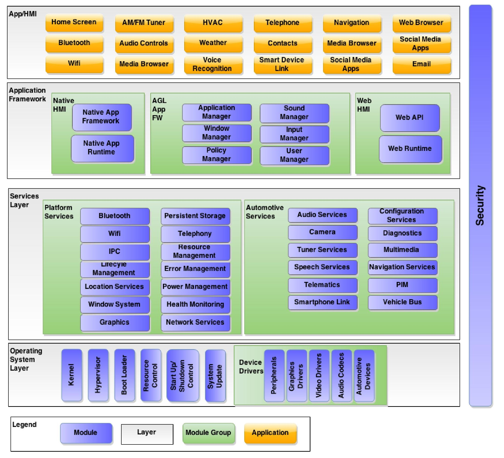

The AGL Unified Code Base (UCB) is a Linux distribution built from the ground up
through a joint effort by automakers and suppliers to deliver a modern
in-vehicle infotainment and connected car experience for consumers. Further
helping reduce fragmentation and facilitate innovation in the development
process. The following use cases are in development or planned to be developed :

 - In Vehicle Infotainment (IVI)
 - Instrument Cluster (IC)
 - Telematics
 - and more :
     - Heads-up Display (HUD)
     - Advanced Driver Assistance Systems (ADAS)
     - Autonomous Driving (AD)

The goal of the UCB platform is to provide 70-80% of the starting
point for a production project. This enables automakers and suppliers to focus
their resources on customizing the other 20-30% to meet their unique product needs.

The [System Architecture Team](https://wiki.automotivelinux.org/agl-sat) defines the overall architecture of the AGL
software according to the business requirements established by the [Steering Committee](https://www.automotivelinux.org/about/steering-committee/).

There are multiple parallel efforts in the areas of the following, with most having specialized [Expert Groups
(EG)](https://wiki.automotivelinux.org/#active_expert_groups) :

   - [App Framework and Security](https://wiki.automotivelinux.org/eg-app-fw)
   - [Navigation](https://wiki.automotivelinux.org/eg-navi)
   - [Speech](https://wiki.automotivelinux.org/eg-speech)
   - [UI and Graphics](https://wiki.automotivelinux.org/eg-ui-graphics)
   - [Connectivity](https://wiki.automotivelinux.org/eg-connectivity)
   - [Continuous Integration and Test](https://wiki.automotivelinux.org/eg-ciat)
   - [Instrument Cluster](https://wiki.automotivelinux.org/eg-ic)
   - In Vehicle Infotainment (IVI)
   - [Reference Hardware System Architecture](https://wiki.automotivelinux.org/eg-rhsa)
   - Telematics
   - [Requirements Specification](https://wiki.automotivelinux.org/eg-requirements-specification)
   - [Vehicle to Cloud](https://wiki.automotivelinux.org/eg-v2c)
   - [Virtualization](https://wiki.automotivelinux.org/eg-virt)

The Automotive Grade Linux Software Architecture diagram is below. The architecture consists
of five layers. The App/HMI layer contains applications with their associated business logic and
HMI.

The Application Framework layer provides the APIs for creating both managing and running
applications on an AGL system. The Services layer contains user space services that all
applications can access. The Operating System (OS) layer provides the Linux kernel and device
drivers along with standard OS utilities. For IVI (In Vehicle Infotainment)
system a full fledged demo is [available](../../0_Getting_Started/1_Quickstart/Using_Ready_Made_Images.md).