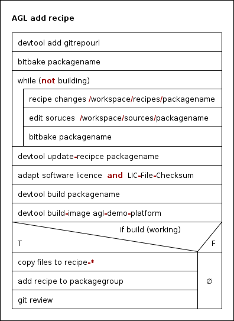

For adding a custom linux software/service like cannelloni you have to do the following steps:

1. Add repo via devtool (gitrepo stands for the url)

	```
	devtool add gitrepo
	```
2. Try to bitbake, if it is working go to step 3
	
	```
	bitbake packagename (gitrepo name)
	```
    If it is not working you can do (repeating) following steps until it is working

	1. change/modify the recipe in /workspace/recipe/packagename
	2. change/modify  the sources in /workspace/sources/packagename 
    3. bitbake packagename

	Now update the recipe, if you do this the first time you have to adapt the license and the LIC-File-Checksum

	```
	devtool update-recipce packagename
	```

3. Build the recipe and image with devtool
  
    ```
	devtool build packagename
	devtool build-image agl-demo-platform
    ```

	If that is working you could add it to git/gerrit. You have to add your recipe to a layer.

	1. Copy files to the recipe
	2. add recipe to a packagegroup
	
4. Git 

	```
	git review 
	git review -s
	git remote -v update
	```
