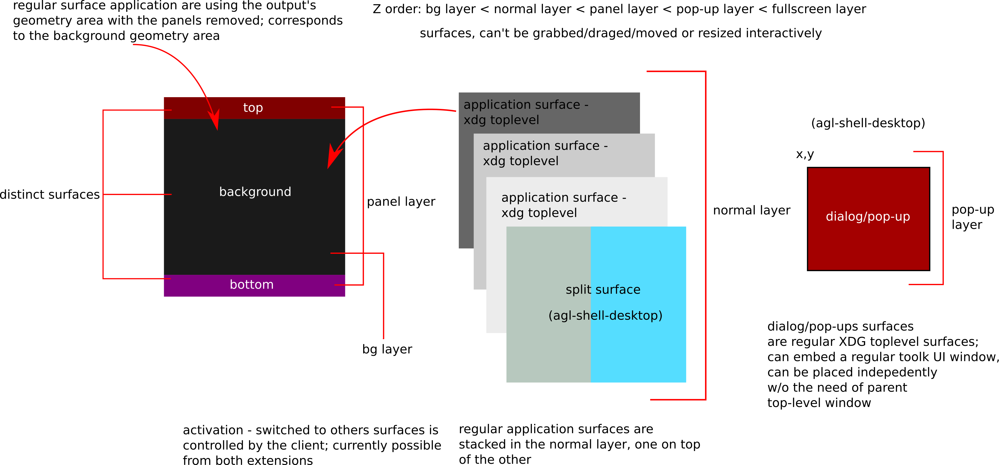

# Wayland compositor

When the AGL project was started, weston was chosen as the compositor, which is
the reference implementation of a Wayland compositor, while for window management
functionality it relied on *ivi-shell* (In-Vehicle Infotainment) together
with an extension, called [wayland-ivi-exension](https://github.com/GENIVI/wayland-ivi-extension).

A demo platform image of AGL comes with a handful of demo applications, done
with the Qt, which abstracts the protocol communication between the client and
the compositor. Additional functionality was in place under the form of
library, to control and signal back to the compositor when applications were
started, among other things.

Management of applications, starting, running and stopping them is done in AGL
with AppFW [Application Framework Management](../3_Developer_Guides/1_Application_Framework/1_Introduction.md),
which is an umbrella name to denote the suite of tools and daemons that handle
all of that. It is integrated with systemd and with the current security model.
Applications can use AppFW to hang off data, and to pass it down to
other services. Together with AppFW, applications could tell the compositor
which application to activate or to switch to.


## Simplifying the graphical stack

Trimming down these abstractions, simplifying the way clients interact with the
compositor, and avoid using modules that aren't really maintained upstream were
the reasons behind looking at alternatives to ivi-shell. On the desktop,
[xdg-shell](https://gitlab.freedesktop.org/wayland/wayland-protocols/-/raw/master/stable/xdg-shell/xdg-shell.xml)
is currently de-facto protocol for handling all window management related
functionality.

Wayland protocol has a window-like interface embedded into its protocol (called
wl_shell), but *xdg-shell* has long time ago deprecated it and instead
of adding it in the wayland protocol namespace, it was integrated
together with some other useful protocols, into
[wayland-protocols](https://gitlab.freedesktop.org/wayland/wayland-protocols)
project.  The whole purpose of wayland-protocols is to enhance the Wayland
protocol with new functionality and bring new extensions entirely.  Compositors
are free to implement, modify, enhance, and add new extensions to
wayland-protocols but they need to do so in consensus.

Besides the core wayland protocol and extended functionality from
wayland-protocols, a compositor can provide and implement additional protocol
extensions (custom to that compositor). By using such private extensions we
align with the AGL project and its requirements, without compromising specific
functionality and allows to add or improve the current ones. With that in mind,
the approach was to create a new compositor, called
[agl-compositor](https://gerrit.automotivelinux.org/gerrit/admin/repos/src/agl-compositor)
and implement dedicated private extensions, rather than trying to modify weston
itself, which AGL project would have been required to keep and maintain for
itself, as a fork.

## A compositor based on libweston

The compositor used currently in AGL, just like weston, is built on top of
*libweston* and *libweston-desktop*. The latter, among other things, is required
as it provides the server side implementation of the xdg-shell protocol which
underlying toolkits (like Qt/Chromium project) makes use of to deliver
desktop-like functionality. The former is used to provide back-ends and
rendering support, effectively managing the HW, besides implementing the
wayland protocol.

The high-level goal of [libweston](https://wayland.pages.freedesktop.org/weston/toc/libweston.html) is
to decouple the compositor from the shell implementation.

Traditionally, clients were entirely separated from the window manager, the
desktop environment and the display server. In wayland all these are
conceptually under the same entity though they are implemented as different
(UNIX) processes, or as a different namespaces with front and back-end APIs,
exposed by libraries. The compositor and the shell driving the UI should be
seen as one and the same, and in practice, this happens on desktop
environments. For AGL, the shell client can be represented under different
forms, as well as the fact that the process management has another layer
baked-in to handle MAC (Mandatory Access Control) labels and use the
above-mentioned Application Framework. These are all tightly
integrated and therefore, the AGL compositor will not automatically start the
shell client, although there's code to handle that.

## Specifying a shell client to be started by the compositor

Nevertheless, one can modify the configuration file, add the shell client path, and the
compositor will attempt to start it.

```
[shell-client]
command=/path/to/your/client/shell
```


## Private extensions

Compositors can define and implement custom extensions to further control
application behaviour. For AGL, we have two private extensions defined.
One targeted at defining surface roles commonly found in desktop environments
(like panels, and backgrounds), which a shell client would bind to, and one
targeted at regular application(s) that might require additional functionality:
being able to display/activate its own surface or other's application surface,
implement some kind of split screen management of windows, or
dialog/pop-ups that exhibit always-on-top property even if the active
surface has been changed.



Clients can make use of these private extensions to define other kind of roles
for instance dialog/pop-ups or full-screen roles, and split windows vertically or
horizontally. It includes the ability to activate other applications, assuming
that the surfaces have been created, and the capability of delaying
presentation for the client shell. Doing so, all the information is displayed
at once, rather than waiting for the toolkit to map/show the surface.

An application identification mechanism was required to be able to activate
other clients windows/surfaces. A string-based identifier name was chosen
which can be used by the client to set an application-based identifier using
the xdg-shell protocol. While there's nothing stopping the client to avoid
doing that, specifically, to avoid assigning an application identifier,
the compositor won't be able to find which surfaces matches to a particular
client, if one would want to activate/display it at some time in the future.

### agl-shell

Client shellls can make use of this protocol to define panels and background
roles for different surfaces. It includes to ability to activate other
applications, assuming that those are already running. Activation happens by
using using the app_id, respectively using set_app_id request as defined by the
xdg-shell protocol. Established client-side implementation of the xdg-shelll
protocol will have a function exposed which can be used to set an application
identifier.  Further more, the compositor will not present/display anything to
the user as long the `ready()` is not requested. So, after creating the surfaces
assigning them panel and/or background roles, and they're fully loaded,
the client can then issue `ready()` request and the compositor will start
presenting.

Please consult the [protocol file](https://gerrit.automotivelinux.org/gerrit/gitweb?p=src/agl-compositor.git;a=blob_plain;f=protocol/agl-shell.xml;hb=refs/heads/master)
as that is the authoritative way of getting the latest version.

### agl-shell-desktop

This extension is targeted at keeping some of the functionally already
established in AGL as to a) allow applications display/activate other
surfaces/application window, and b) set further roles, specially dialog/window
pop-ups and split-type of surfaces.

Clients can make use of this protocol to set further roles, like independently
positioned pop-up dialog windows, split type of surfaces or fullscreen ones.
Additional roles, and implicitly functionality can be added by extending the
protocol. These roles serve as hints for the compositor and should be used
before the actual surface creation takes place, such that the compositor can
take the necessary steps to satisfy those requirements.

Please consult the [protocol file](https://gerrit.automotivelinux.org/gerrit/gitweb?p=src/agl-compositor.git;a=blob_plain;f=protocol/agl-shell-desktop.xml;hb=refs/heads/master)
as that is the authoritative way of getting the latest version.

#### Additional surface roles in agl-shell-desktop

Like mentioned earlier, the compositor is already making use of some (internal)
roles, and with this extension we add some further ones. These are:

* split (there's vertical and a horizontal one)
* fullscreen
* dialog/pop-up

Internally these are encoded with different values such that there's a
translation needed, between the protocol values and the internal ones.  Besides
the roles, additional data can to be passed on, but only depending on the role.
It is highly recommend **to avoid** using the protocol to pass down information
between different applications using this communication channel. It is only
intended to help out with demo applications. Other sharing mechanism are
available in the AGL project that can satisfy those requirements.

#### Receiving application state events from (other) applications

agl-shell-desktop exposes two events which client can install handlers for, one
that signals when regular xdg application have been created, and one that
signals state changes (active/hidden) as well as destroyed/no longer present
surfaces. These events can be useful to add additional functionality if
needed.

#### Activating (other) applications

Both agl-shell and agl-shell-desktop have requests to activate other
application based on their xdg-shell app_id. In case the application is
present/running, it will attempt to make the surface backing that application
the current activate one, with each output having independently active
surfaces.

## Explicit output

The activation and setting surface roles requires passing a Wayland output
(wl_output).  The output is the wayland interface representation of an output
and is **mandatory** to pass it down to the compositor when activating a surface.
Clients can retrieve it (the output) if they wish to place the surface on other
outputs by using the toolkits that expose the Wayland objects.  A human-like
representation is provided by either the toolkit, or by using other extensions
implemented by the client, for instance [xdg-output](https://gitlab.freedesktop.org/wayland/wayland-protocols/-/raw/master/unstable/xdg-output/xdg-output-unstable-v1.xml)
is the one recommended way and provides a mapping between a human
representation of the output and the wayland one.

One can also choose the output where the application can start, by configuring
directly the AGL compositor. Under the `[output]` section one can use
`agl-shell-app-id=appid` restart the AGL compositor unitd systemd service and
start the application. Currently this *only* applies to regular applications, the
client shell having to handle it in the code.

## Available toolkits, application conversions and available eco-systems

Users and OEM vendors alike have the possibility, depending on their use-cases,
to either use some kind of a toolkit (Qt/GTK) for writing  application,
or use plain C and the wayland library to communicate with the compositor
directly, without any toolkit abstraction.

Currently, the demo applications in AGL use the Qt platform with Chromium being
at this phase, a second-class citizen, being currently in the works of
achieving the same level of integration as QtWayland (the underlying library that
abstracts the Wayland interaction) has at this moment. The Qt platform has
long been favoured in embedded systems so it feels natural why AGL project
chose it over other alternatives.  In the same time, as web applications are
for quite some time now permeating the application development scene, it also
felt natural to add support for a runtime that gives that option, which in AGL
was achieved with the help of the Chromium project.

For normal applications, not needing the ability to activate or displaying
other's application surface, would basically mean that it would use what the
toolkit has to offer, simplifying the application handling even more.  Under
Qt, the client shell can use QPA (Qt Platform Abstraction) to gain access to
Wayland primitives, and implicitly is being able use the private extensions.


On the Chromium side of things, that happens indirectly, as Chromium doesn't
expose the Wayland primitives. Not only that, but on the Chromium platform,
there's another mid-layer component, called [WAM](https://github.com/webosose/wam)
(WebApplicationManager) with the purpose of handling web applications life-cycle.

So, controlling and passing information from a web application, that resembles
that of a shell client, has to travel more than a few levels in the software
stack, until it reaches the lower layers in Chromium where the Wayland
communication and interaction takes place. Support for the private extension
was done at the Ozone interface abstraction, which Chromium projects uses now
to handle the display/graphical interaction with the lower stack levels.

## Streaming buffers and receiving events to and from remote outputs

Quite a common feature, in the infotainment market, is the ability to stream
out buffers/data to remote outputs. For instance, super-imposing the navigation
application, between the speedometer and tachometer, in the IC (Instrument
Cluster) of a car is such a scenario. Just like weston, the AGL compositor is
capable of loading up libweston modules and make use of them. And just like
weston, the AGL compositor loads up the remoting-plugin to achieve the same
thing.

The remoting-plugin uses the DRM virtual output API from libweston together
with gstreamer pipeline to capture, using DMA buffers, the DRM output and to
stream it, remotely to another machine. They can be over the network, or
locally.

Further more, to cope with situations where the output is just a
panel/display, without some kind of compositor driving it, the necessity of
handling input events is an important feature to have, giving the user to
possibility to manipulate the application/environment as he or she seems fit.
The compositor loads a plug-in that streams out the buffers to an output
remotely, with [another plug-in](2_waltham-receiver_waltham-transmitter.md)
handling the input events. The events, which are sent back from the display to
the compositor, are generated with the help of wayland-eque protocol that works
over the network, called [Waltham](https://github.com/waltham/waltham).

Together, they provide proper means to achieve a seamless integration with
other display devices in the car cabin.

## Policies and Role Base Arbitration

The compositor contains an API useful for implementing user-defined policies.
It contains a policy engine, and installs by default an allow-all kind of
policy. The policy engine controls if the client using the private extensions
is permitted to perform those calls. Not only that, but with some policies, it
won't allow the client to bind to the interfaces in the first place. That
happens with the deny-all policy, which is able to retrieve the client's
SMACK label and compares it with the ones statically defined.

In the works, there's a new policy model, called [Role Based
Arbitration](https://gerrit.automotivelinux.org/gerrit/admin/repos/staging/rba).
Internally, how it works, should be found at [RBA](3_rba.md).
While the other two policies are embedded into the compositor, the RBA policy
model is an off the-shell policy.  Obviously, vendors and users can hook up
their own policies, just like RBA did.  These all work towards satisfying
the driver distraction mitigation requirement for the AGL project, as to avoid
overwhelming the driver with too much information.

Users wanting  to create their own policy should create a specialized version
of the callbacks defined in `struct ivi_policy_api`.

As there's no dynamic loading of policies you'll need to recompile the compositor
with that policy in mind, specifically like the following:

	$ meson -Dprefix=/path/to/install-compositor/ -Dpolicy-default=my_policy build_directory

The default policy found in src/policy-default.c should more than sufficient to
get started on creating new ones. Users can either re-purpose the default
policy or create a new one entirely different, based on their needs.

These are hooks in place by the policy engine control the creation, committing
and activation of surfaces (`ivi_policy_api::surface_create()`,
`ivi_policy_api::surface_commited()`, `ivi_policy_api::surface_activate()`),
among other situations.

Users can customize the hooks by using some sort of database to retrieve the
application name to compare against, or incorporate some kind of policy rule
engine.  Alternatively, one can use the deny-all policy engine which allows the
top panel applications to be used/displayed as permitted applications.

### Reactive rules

The policy engine is stateful,  and allows the ability to inject back events,
such that it allows the user to add custom rules into a policy and, depending
on the event received by the policy engine, to execute a rule match for that
event. Further more, the framework allows adding new states and events and the
default implementation has code for handling events like showing or hiding the
application specified in the policy rule.  The most common example to exemplify
this feature is the ability to show a custom application, like displaying the
rear view camera application, when the automobile has been put in reverse.

For deadling with these kind of rules, `ivi_policy_api::policy_rule_allow_to_add()`
can be used to control if policy rules could be added or not. Finally, we have
`ivi_policy_api::policy_rule_try_event()` which is executed for each policy
rule added, by using the policy API `ivi_policy_add()` function.

By default the policy framework it will add the 'show', and 'hide' events and
the 'start', 'stop' and 'reverse' states. An special type, assigned by default
is 'invalid'.  A **state change** has to be propagated to the compositor, which can
happen by using `ivi_policy_state_change()` function, and which signals the
compositor the state change took place, in order to apply the policy rules, and
implicitly to call the event handler `ivi_policy_api::policy_rule_try_event()`.

## Back-ends and specific options for agl-compositor

The compositor has support for the following back-ends:

* **DRM/KMS** - runs a stand-alone back-end, uses Direct Rendering Manager/Kernel
  Modesetting and evdev, that is utilizes and runs on real or virtualized HW
  (qemu/Vbox/etc).
* **Wayland** - runs as a Wayland application, nested in another Wayland compositor
  instance
* **X11** - run as a x11 application, nested in a X11 display server instance

### Building and running the compositor on different platforms

The compositor can run on desktop machines as easily as it does on AGL
platform. It should infer, depending on the environment, if it is being
compiled with the AGL SDK, or with the host build system.  Running would also
be inferred from the environment.

The compositor has some additional configuration options like:

* `--debug` - enables the screenshooter interface, useful if one would want to
  take a screenshot using `agl-screenshooter` client. This might be seen as a
  security risk to it only be enabled in the AGL platform if built with agl-devel
  DISTRO FEATURES.

Additional configuration ini options have been added to help with the CI
integration. Worth mentioning are:

* `activate-by-default=[true]` - if the surface of the client should be
  displayed when the application started. Present in the `[core]` section.
  By default set to `true`. Setting it to `false` will not activate,
  by default, the client's surface when started.
* `hide-cursor=[false]` - do not advertise pointer/cursor to clients. Present
  in the `[core]` section.

## Running with software rendering

By default the compositor will attempt to use the GL-renderer, and implicitly
the GPU. One could instead use the CPU, by making use of the Pixman library. To
use it in the compositor append `--use-pixman` to the command line. This purely
software approach has the benefit that would not rely at all on any GL
implementatation or library. In constrast, even if the GL-renderer is used,
in some situations it won't be able to use the GPU supported implementation
and fallback to sofware based one, and for instance that might happen when
running in virtualized environments.

Both approaches could end up not actually using the GPU, but the latter does
actually use the GL library and perform the operations in software, while the
former does not use any GL whatsover. All back-ends support disabling the
GL-render to make sure it does not interfere with the composing process.

## Multiple output set-up and touch input devices

There's no deterministic way in which the compositor enables the outputs and
depending on the input devices, specifically touch input devices, and the way
the connectors are wired, a touch input device might be associated with a
different output than the one intended.

A consistent way, that survives a reboot, is to use
[udev rules](https://man7.org/linux/man-pages/man7/udev.7.html), which
libweston would be able to use such that a particular output is tied/associated
to a particular touch input device.

For instance, assuming that you have a set-up consisting of 4 outputs, a 4
touch input devices, when the outputs are being enabled the compositor
front-end will associate all 4 touch input device -- if they haven't been
previously being associated to a particular output, to the first enabled
output.

In order to avoid that, and associate each touch input device to
their respective output an udev rule can be installed, for the default
seat (named `seat0`).

Example of a udev rule:

```
SUBSYSTEM=="input", ATTRS{idVendor}=="222a", ATTRS{idProduct}=="004a", OWNER="display", ENV{ID_SEAT}="seat0", ENV{WL_OUTPUT}="HDMI-A-1"
SUBSYSTEM=="input", ATTRS{idVendor}=="222a", ATTRS{idProduct}=="004b", OWNER="display", ENV{ID_SEAT}="seat0", ENV{WL_OUTPUT}="HDMI-A-2"
SUBSYSTEM=="input", ATTRS{idVendor}=="222a", ATTRS{idProduct}=="004c", OWNER="display", ENV{ID_SEAT}="seat0", ENV{WL_OUTPUT}="HDMI-A-3"
SUBSYSTEM=="input", ATTRS{idVendor}=="222a", ATTRS{idProduct}=="004d", OWNER="display", ENV{ID_SEAT}="seat0", ENV{WL_OUTPUT}="HDMI-A-4"
```

Add the following under `/etc/udev/rules.d/91-output.rules` and reload udev
rules for these changes to take effect:

	$ udevadm control --reload-rules && udevadm trigger

Note that in the above example, we use physical seat, named `seat0` which is
the default physical seat. You can verify that these changes have been applied by
checking the compositor logs (under `/run/platform/display/compositor.log` file)
You should be seeing `CONNECTOR-NO by udev` message like the following:

```
associating input device event0 with output HDMI-A-1 (HDMI-A-1 by udev)
```

vs

```
associating input device event0 with output HDMI-A-2 (none by udev)
```

where the rules are either incorrect or badly written.

Retrieving device attributes could be done archaically using `lsusb` or `lspci`
or using `udevadm info -a /dev/input/event*` which can provide with a multitude
of attributes to use. In our above example we only relied `idVendor` and
`idProduct` but potentially other attributes might be used.
