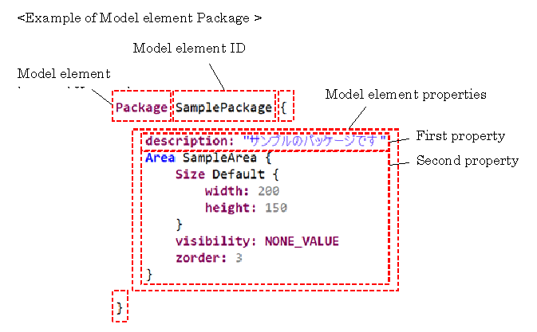
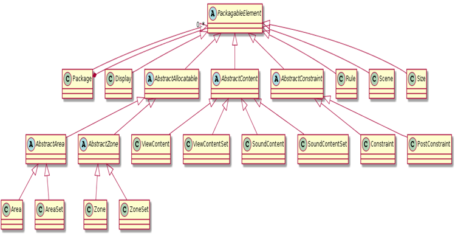

# RBA

Rule Based Arbitrator decides which of the content to display when a large number of contents to be displayed on the cockpit display device (CID, meter, HUD, etc.) occur simultaneously under a certain rule (arbitration).

### 1. Overview

#### 1.1 Purpose of this document

This document describes the syntax of the Rule-based Arbitration Model.

#### 1.2 Basic syntax

The basic syntax of the Rule-based Arbitration Model is as follows.



Define the properties of the model element in {} after declaration of Model element keyword,　Model element ID. Each property depends on the element. The properties of the model element may also define other model elements.

#### 1.3 Relationship between files and Model definitions

The Rule-based Arbitration Model can be defined in multiple files. (The extension of the file will be ".rba") Firstly, define the Package model element in the file.

Areas.rba
```shell
Package AreasPackage {

}
```
Content.rba
```shell
Package ContentsPackage {

}
```

#### 1.4 Structure of Rule-based Arbitration Model

The elements of the Rule-based Arbitration Model are as follows. Each inheritance relationship between elements is defined and expresses elements that can be described in PackagableElement.



#### 1.5 Notation of Syntax Definition

For Model element

syntax:
```shell
Package [ID] {
  description: [String]
  [PackagableElement]
}
```

Description:

| Syntax element            | Description  |
| :---                      |    :----     |
| description:	0..1        | Description  |
| [PackagableElement]	*   | Child element Package,Display,Size,Constraint,PostConstraint,Scene,Event,Rule,Area,AreaSet,ViewContent,ViewContentSet|

The multiplicity is expressed as follows:

| Expression of multiplicity	| Description |
| :---                          | :---        |
| *	                        | 0 or more   |
| 1..*                          | 1 or more   |
| 1	                        | 1           |
| 0..1	                        | 0 or 1      |

Description of [] notation is as follows:

| Syntax element            | Description  |
| :---                      |    :----     |
| [ID]			    | ID. A character string in which the first character is not a number. Only _ can be used for symbols, Space cannot be used.
| [String] 		    | An arbitrary character string. specify it by enclosing with "". |
| [Number] 		    | An integer that is greater than equal 0. |
| [expression] 		    | An expression whose return value is a property type. |
| [<Model element keyword\>] | Definition of other Model elements. Sometimes an abstract class is specified. |
| [ID of A]		    | Reference to other Model elements. A represents an element. |
| [X\|Y]		    | Indicates that you can describe X or Y. |

### 2. Common

#### 2.1 Package

The Package element is the root element in the file. It has PackagableElement as a Child element and groups PackagableElements in arbitrary units.

syntax:
```shell
Package [ID] {
  description: [String]
  [PackagableElement]
}
```

| Syntax element            | Description  |
| :---                      |    :----     |
| description:	0..1        | Description  |
| [PackagableElement]	*   | Child element Package,Display,Size,Constraint,PostConstraint,Scene,Event,Rule,Area,AreaSet,ViewContent,ViewContentSet|

Description example:
```shell
Package SamplePackage {
	description: "This is a sample Packege"
	Area SampleArea {
		arbitrationPolicy: DEFAULT
		sizeReference: SampleSize1
		visibility: NONE_VALUE
		zorder: 3
	}
	ViewContent SampleContent {
		allocatable: [SampleArea1]
		State NORMAL {
			priority: STANDARD_VALUE
		}
	}
}
```

#### 2.2 Size

Size is the size of Area and ViewContent.

Syntax:

```shell
Size [ID] {
  description: [String]
  width: [Number]
  height: [Number]
}
```

| Syntax element            | Description  |
| :---                      |    :----     |
| description:	0..1	    | Description of Size element |
| width: 1	            | width  |
| height:	1	    | height |

Description example:
```shell
Size ScreenSize {
	description: " Screen size"
	width: 200
	height: 200
}
```

#### 2.3 Project

The Project element is an element that can be defined only once in one project.
Like The Package element, it can be defined directly under the file.

Syntax:
```shell
Project {
  version: [String]
}
```

| Syntax element            | Description  |
| :---                      |    :----     |
|version:	1|	Version of the Project|

Description example:
```shell
Project {
	version: "version 1.0"
}
```


### 3. Area

Area is a frame to display the ViewContent on the screen. Only one ViewContent is allocated to one Area at most. Since Arbitration is executed for each Area, the Arbitration Policy is defined.

Syntax:

```shell
Area [ID] {
  description: [String]
  arbitrationPolicy: [DEFAULT | FIRST_COME_FIRST | LAST_COME_FIRST | PRIORITY_FIRST_COME_FIRST | PRIORITY_LAST_COME_FIRST]
  [[Size]| sizeReference:[ID of Size]]
  [visibility|priority]:[Number|Expression]
  zorder:[Number|Expression]
}
```

| Syntax element |	Description |
| :---                      |    :----     |
| description:	0..1 | Description |
| arbitrationPolicy: 0..1 | Arbitration Policy for Area. Refer to "Types of Arbitration Policy" for the policies which can be specified. If not specified, consider it as "DEFAULT".
| [Size\|sizeReference:]	1..* | Size: Size definition.|
|| sizeReference: Reference to Size definition.|
|| ※One or more definitions of either Size or sizeReference are needed. Multiple definitions should be defined consecutively.|
| [visibility\|priority]:	1	| Value of Area. Describe the relative value for other Areas as an expression or set a numerical value.|
|| The following predefined value can be set as a String. NONE_VALUE, STANDARD_VALUE, MIN_VALUE, MAX_VALUE See " Value / Z order definition" for details. |
| zorder:	1 | Z order of Area. Describe the relative Z order for other Areas as an expression or set a numerical value. The following predefined value can be set as a String. |
||NONE_VALUE, STANDARD_VALUE, MIN_VALUE, MAX_VALUE See " Value / Z order definition" for details. |


Types of Arbitration Policy

| Arbitration Policy           | Description  |
| :---                      |    :----     |
| DEFAULT | Same as Priority and First Come First Arbitration. If the Arbitration Policy is not specified, it will be this type.|
| FIRST_COME_FIRST | First Come First Arbitration. Give priority to the request which occurred first. |
| LAST_COME_FIRST | Last Come First Arbitration. Give priority to the request which occurred later. |
| PRIORITY_FIRST_COME_FIRST | Priority and First Come First Arbitration. It follows the priority set to the Content. If the priority is the same, give priority to the request which occurred first. |
| PRIORITY_LAST_COME_FIRST | Priority and Last Come First Arbitration. It follows the priority set to the Content. If the priority is the same, give priority to the request which occurred later.|

Description example:
```shell
Area SampleArea {
	description: "This is a sample Area."
	arbitrationPolicy: DEFAULT
	Size Default {
		width: 200
		height: 150
	}
	sizeReference: SampleSize1
	visibility: NONE_VALUE
	zorder: 3
}
```

### 4. Value / Z order definition

Values (visibility or priority) of area is the order of arbitrating of the area. The higher is arbitrated first. You can describe only one of the visibility or priority.
For the Z order (zorder), the higher one will be on the front of the screen. You can define values absolutely by number or define relatively to other areas by expressions. You can use comparison operators (> and <), equality operator (=) and That-of operator for the expressions.

- Description example of value :
Visibility of SampleArea2 is 10, zorder is 5.
```shell
Area SampleArea2 {
	visibility: 10
	zorder: 5
}
```
- Description example of comparison operator:
Priority of SampleArea1 is greater than SampleArea2. Zorder of SampleArea1 is less than SampleArea3.
```shell
Area SampleArea1 {
	priority: > That-of SampleArea1
	zorder: < That-of SampleArea3
}
```
- Description example of range:
Visibility of SampleArea1 is greater than 1 and less than SampleArea2. Zorder of SampleArea1 is greater than SampleArea3 and less than SampleArea4.
```shell
Area SampleArea1 {
	visibility: (> 1 AND < That-of SampleArea2)
	zorder: (> That-of SampleArea3 AND < That-of SampleArea4)
}
```

- Description example of equality operator:
```shell
Area SampleArea1 {
	visibility: = That-of SampleArea2
	zorder: = That-of SampleArea3 + That-of SampleArea2
}
```

- Equality operator can be omitted.
```shell
Area SampleArea1 {
	visibility: That-of SampleArea2
	zorder: That-of SampleArea3 + That-of SampleArea2
}
```

### 5. ViewContent definition

#### 5.1 ViewContent

ViewContent is an object to be displayed in the Area. ViewContent has multiple states. When ViewContent is allocated to an Area, active state of theViewContent is displayed. Define the Area which can display ViewContent to the ViewContent. You can define several Areas.

Syntax:
```shell
ViewContent [ID] {
  description: [String]
  allocatable: [ [ID of Area] | [ID of Set] ]
  [ViewContentState]
  [[Size]|sizeReference: [ID of Size]]
  loserType: [GOOD_LOSER | DO_NOT_GIVEUP_UNTIL_WIN | NEVER_GIVEUP]
}
```

|Syntax element	|	Description|
| :---              |    :----     |
|description:	0..1 | Description|
|allocatable:	0..* |	Displayable Area. Specify the ID of displayable Areas or Sets with comma-separated.If don’t specify allocatable, should specify allocatable in the ViewContentSet that includes this ViewContent. |
| [ViewContentState]	1..* |Define the State of ViewContent.|
|[Size\|sizeReference:]	1..*|Size: Size definition|
||sizeReference: Reference to Size definition.|
||※One or more definitions of either Size or sizeReference are needed. Multiple definitions should be defined consecutively.|
|loserType:	0..1| Action on lost. Specify whether to cancel a request, if ViewContent is not displayed after arbitration. See "Types of Action on lost" for details. If not defined, consider it as "NEVER_GIVEUP".|

Types of Action on lost

|loserType |	Description|
| :---              |    :----     |
|GOOD_LOSER	|When losing arbitration, cancel a request.|
|DO_NOT_GIVEUP_UNTIL_WIN |When the state is changed visible to invisible , cancel a request.|
|NEVER_GIVEUP|Keep a request.|

Description example:
```shell
ViewContent Power {
description: " Warning from power management"
  allocatable: [
    MessageArea, HUDMessageArea
  ]
  State Warning {
    priority: > That-of Power.Attention
  }
  State Attention {
    priority: > That-of TEL.Incoming
  }
Size Default {
description: "Default size"
width: 200
height: 200
}
  sizeReference: InterruptMessageSize
  loserType: GOOD_LOSER
}
```
#### 5.2 State(ViewContent)

State is the state of the ViewContent.

Syntax:
```shell
State [ID] {
  description: [String]
  [priority|value]: [Number|Expression]
}
```

|Syntax element	|	Description|
| :---              |    :----     |
|description: 	0..1 |	Description
|[priority\|value]:	1 |	Priority of ViewContent. |
||Describe the relative value for other State under ViewContent as an expression, or set a numerical value. |
||The following predefined value can be set as a String.NONE_VALUE, STANDARD_VALUE, MIN_VALUE, MAX_VALUE See "Priority definition"for details. |

Description example:
```shell
State Warning {
  description: "Display warning message"
priority: > That-of Attention
}
State Attention {
  description: " Display attention message "
priority: > That-of TEL.Incoming
}
```
### 6. Priority definition

Define the priority of Content to the State under ViewContent or SoundContent (hereinafter, Content). The priority is used when the area / zone arbitration policy is "Priority and First Come First Arbitration" or "Priority and Last Come First Arbitration", the higher one is allocated first. Values can be defined absolutely by number or relative to other areas by expressions. You can describe only one of the visibility or priority. You can use comparison operators (> and <), equality operator (=) and That-of operator for the expressions.

- Description example of value:
Priority of Warning is 10.
```shell
State Warning {
  description: " Display warning message "
priority: 10
}
```
- Description example of comparison operator:
Value of Warning is greater than Attention.
<br>Value of Attention is greater than State Incoming of TEL of other Content.
<br>Value of Notice is less than Attention.
<br>※When referring to the State of another Content, refer to the Content ID and State ID by connecting with “.”.
```shell
State Warning {
  value: > That-of Attention
}

State Attention {
  value: > That-of TEL.Incoming
}

State Notice {
  value: < That-of Attention
}
```

- Description example of range: Priority of Attention is greater than Incoming of TEL and less than Warning.
<br>※When referring to the State of another Content, refer to the Content ID and State ID by connecting with “.”.
```shell
State Attention {
  priority: (> That-of TEL.Incoming AND < That-of Warning)
}
```

- Description example of equality operator:Value of Attention is equal to State Incoming of TEL of other Content.
```shell
State Attention {
  priority: = That-of TEL.Incoming
}
```
- Equality operator can be omitted.
```shell
State Attention {
  priority: That-of TEL.Incoming
}
```

### 7. Screen layout definition

#### 7.1. Display

Display represents one screen. When defined more than one, it will be Multi-screen layout.
The Display defines the set of Areas to be allocated on the screen.

Syntax:
```shell
Display [ID] {
  description: [String]
  [CompositeArea]
  [[Size]|sizeReference:[ID of Size]]
}
```

|Syntax element	|	Description|
| :---              |    :----     |
| description: 	0..1 |	Description|
|[CompositeArea]	1 |	Component of the screen|
|[Size\|sizeReference:]	1 |	Size: Size definition|
|| sizeReference: Reference to Size definition|
|| ※One or more definitions of either Size or sizeReference are needed. |

Description example:
```shell
Display METER {
	description:"Meter display definition"
	Size FULLSCREEN {
		width: 500
		height: 400
	}
	CompositeArea METER_Root {
		layout: FixedPositionLayout {
			PositionContainer {
				x: 100
				y: 100
				basePoint: LEFT_TOP
				areaReference: SpeedMeterArea
			}
		}
	}
}
```

#### 7.2. CompositeArea

CompositeArea specifies an Area that becomes a component of Display.

Syntax:
```shell
CompositeArea [ID] {
  description: [String]
  layout: [FixedPositionLayout]
}
```

|Syntax element	|	Description|
| :---              |    :----     |
|description: 	0..1 |	Description |
|layout: [FixedPositionLayout]	1|	Layout type of Area|

Description example:
```shell
CompositeArea METER_Root {
	description:" Definition of Area’s layout method"
	layout: FixedPositionLayout {
		PositionContainer {
			x: 100
			y: 100
			basePoint: LEFT_TOP
			areaReference: SpeedMeterArea
		}
	}
}
```

#### 7.3. FixedPositionLayout

FixedPositionLayout declares that areas are laid out with fixed values. The specific position define by PositionContainer.

Syntax:
```shell
FixedPositionLayout {
  [PositionContainer]
}
```

|Syntax element	|	Description|
| :---              |    :----     |
|[PositionContainer]	1..*|	Position information.|

```shell
FixedPositionLayout {
	PositionContainer {
		x: 100
		y: 100
		basePoint: LEFT_TOP
		areaReference: SpeedMeterArea
	}
}
```
#### 7.4. PositionContainer

PositionContainer specifies the display position of the Area.

syntax:
```shell
PositionContainer {
  x: [Number]
  y: [Number]
  basePoint: [Value]
  areaReference: [ID of Area]
  [Offset]
}
```

|Syntax element	|	Description|
| :---              |    :----     |
|x:	1	|x position|
|y:	1	|y position|
|basePoint:	1 |	Defined x, y position. The following predefined value can be set.|
|| CENTER_BOTTOM (Define x, y as the lower center position)|
|| CENTER_MIDDLE(Define x, y as center position)|
|| CENTER_TOP (Define x, y as the upper center position)|
||LEFT_BOTTOM (Define x, y as the lower left position)|
||LEFT_MIDDLE (Define x, y as the left center position)|
||LEFT_TOP (Define x, y as the upper left position)|
||RIGHT_BOTTOM (Define x, y as the lower right position)|
||RIGHT_MIDDLE (Define x, y as right center position)|
||RIGHT_TOP (Define x, y as the upper right position)|
|areaReference:	1|	Area to be placed in Display. Specify ID of the Area.|
|[Offset]	0..*|	Display position offset of AreaSpecify the position of the Area for each size.|


Description example:
```shell
FixedPositionLayout {
	PositionContainer {
		x: 100
		y: 100
		basePoint: LEFT_TOP
		areaReference: SpeedMeterArea
		Offset { x:-50 y:20 sizeReference: SpeedMeterArea }
	}
}
```
#### 7.5. Offset

Offset is the offset position for each size.

Syntax:
```shell
Offset {
  description: [String]
  x: [Number]
  y: [Number]
  sizeReference: [ID of Size]
}
```

|Syntax element	     |	Description|
| :---             |    :----     |
|description: 	0..1|	Description|
|x:	1|	Offset from x position of PositionContainer.|
|y:	1|	Offset from y position of PositionContainer.|
|sizeReference:	1|	Size to apply the offset. Specify ID of Size.|
||※ This Size must be specified in Area.|

Description example:
```shell
Offset {
description:"Offset"
	x: 100
	y: -50
	sizeReference: SpeedMeterSize
}
```

### 8. Constraint defination

Constraints can be defined according to the state of the Area/Zone and the state of the ViewContent/SoundContent. The syntax can be used for Constraints is shown below.

- State reference of Area:

|Name	| Notation	|Meaning|
| :---              |    :----     |    :----     |
|IsDisplayed | <Area\>.isDisplayed()|	The Area is displayed. (At this time, the ViewContent is necessarily allocated to the Area) True if the Area is displayed.|
|DisplayingContent| 	<Area\>.displayingContent()|	ViewContent which is displayed in the Area. When the Area is hidden or ViewContent is not allocated, it is not evaluated.
|AllocatedContent|	<Area\>.allocatedContent()|	ViewContent which is allocated to the Area. Even if the Area is hidden after allocation, it is possible to refer to the allocated ViewContent.|
|IsHidden|	<Area\>.isHidden()	|The Area is hidden. Regardless of whether the ViewContent is allocated to the Area or not,true if the Area is hidden.|
|ContentValue|	<Area\>.contentValue()|	The value of the ViewContentState allocated to the Area. If ViewContent is not allocated to the Area, it is not evaluated.|
|ContentsList|	<Area\>.contentsList()|	A set of ViewContent which is allocatable to the Area.|
|activeContents|	<Area\>.activeContents()	|The set of active content amang the ViewContent which is allocatable to the Area|

- State reference of ViewContent:

|Name	| Notation	|Meaning|
| :---              |    :----     |    :----     |
|IsActive|	<ViewContent\>.isActive()|	True if there is a Content request of ViewContent.|
|IsVisible|	<ViewContent\>.isVisible()|	The ViewContent is displayed. True if the ViewContent is allocated to any Area.|
|StateValue	|<ViewContent\>.stateValue()	|Priority/value that is defined in active state of the ViewContent. When the ViewContent has no active state, it does not evaluate.|
|HasComeEarlierThan|	<ViewContentA\>.hasComeEarlierThan(<ViewContentB\>)|	True if the ViewContentA’s request has come earlier than the ViewContentB’s. When the either ViewContent has been not requested, it does not evaluate.|
|HasComeLaterThan|	<ViewContentA\>.hasComeLaterThan(<ViewContentB\>)	|True if the ViewContentA’s request has come later than the ViewContentB’s. When the either ViewContent has been not requested, it does not evaluate.|
|Allocatables|	<ViewContent\>.allocatables()|	A set of Areas where the ViewContent can be displayed.|

- Scene reference:

|Name	| Notation	|Meaning|
| :---              |    :----     |    :----     |
|IsOn|	<Scene\>.isOn()|	True if the Scene is valid.|
|Get|	<Scene\>.<Property\>.get()|	Get scene property value.|

- Stereotyope:

|Name	| Notation	|Meaning|
| :---              |    :----     |    :----     |
|isTypeOf|	<Model\>.isTypeOf(“<ID of Stereotype\>”)|	Whether or not “<ID of Stereotype\>” is used in the <Model\> |
|||It can be applied to the following models Area,ViewContent|

- Operator:

|Name	| Notation	|Meaning|
| :---              |    :----     |    :----     |
|AND|	<Bool expression\> AND <Bool expression\>|	True if all Bool expressions are true.|
|OR|	<Bool expression\> OR <Bool expression\>	|True if any Bool expression is true.|
|Negation|	! <Bool expression\>|	True if Bool expression is false.|
|Implication|	<Bool expression\> -> <Bool expression\>	| A -> B is equivalent to ((A AND B) OR !A).|
|Equal sign (Comparison of values)|	<Expression\> = <Expression\>|	True if the values shown on the left-hand side and the right-hand side are identical.The type of left-hand side and the right-hand side expressions must match.|
|Equal sign (Comparison of objects)	|<Expression\> == <Expression\>|	True if the values shown on the left-hand side and the right-hand side are identical.The type of left-hand side and the right-hand side expressions must match.|
|Comparison (greater than)	|<Number\> \> <Number\>|True if the Number on the left-hand side is greater than the Number on the right-hand side.|
|Comparison (greater than)|	<Number\> \>= <Number\>|True if the Number on the left-hand side is greater than equal to the Number on the right-hand side.|
|Comparison (less than)|	<Number\> < <Number\>|	True if the Number on the left-hand side is less than the Number on the right-hand side.|
|Comparison (less than)|	<Number\> <= <Number\>|	True if the Number on the left-hand side is less than the equal to Number on the right-hand side.|

- Quantization symbol:

|Name	| Notation	|Meaning|
| :---              |    :----     |    :----     |
|∀(For All)	|For-All<Set\>{ <x\> \| <Expression\> }	|<Set\> contains the ViewContentSet or the SoundContentSet, the AreaSet, the ZoneSet, and the One-time Set. True if <Expression\> is true for all set element <x\>.|
|∃(Exists)|	Exists< Set\>{ <x\> \| <Expression\> }	|<Set\> contains the ViewContentSet or the SoundContentSet, the AreaSet, the ZoneSet, and the One-time Set. True if < Set\> has one or more elements that satisfy <Expression\>.|

- Built-in defined Expression:

|Name	| Notation	|Meaning|
| :---              |    :----     |    :----     |
|All Area|	ALL_AREAS|	A set of all the Areas defined in the Model.|
|All ViewContent|	ALL_VIEWCONTENTS|	A set of all the ViewContents defined in the Model.|
|IF-THEN-ELSE Syntax|	IF (<Bool expression\>)THEN <Expression\>ELSE <Expression\>|	The type of the expression must be identical, for the THEN clause, if the Bool expression is true, for THEN and ELSE clause ,if the Bool expression is false.|
|Let　Expression|	let <Variable name\> = <Object expression\>|	Evaluate <Object expression\>　as variable <variabl name>, which can then be referenced in subsequent expressions|
|||Can only be used inside the expression. For-All, Exists, Max, Min, Select|
|Pre-arbitration value specifier|	(pre)<Area \| ViewContent \| Scene\| Scene.Property\> |	Refere to the state before arbitration of Area, ViewContent, Property.|

**The syntax precedence and associativity are shown below:**

|Priority|	Name|	Notation|	Connectivity|
| :---              |    :----     |    :----     | :----     |
|1	|Parentheses|	(<Expression\>)	|-|
|2|	∃(Exists)|	Exists<Set\>{ <x\> \| <Expression\> }|-|
||	∀(For All)|	For-All<Set\>{ <x\> \| <Expression\> }|	-|
||	IF-THEN-ELSE Syntax|	IF (<Bool expressinon\>) THEN <Expressinon\> ELSE <Expressinon\>|	-|
||SetOf operator|	{ <Expression\>, <Expression\> }|	-|
||	Pre-arbitration value specifier|	(pre)<Area\| ViewContent\| Scene\| Scene.Property\>|	-|
|3|Predicate connector	|<Object\>.<Predicate expression\>|	Left|
|4	|Negation|	! <Bool expression\>|	Right|
|5|	Comparison (less than)|	<Number\> < <Number\>|	Left|
||	Comparison (greater than)|<Number\> \> <Number\>|Left|
||	Comparison (less than)|	<Number\> <= <Number\>|	Left|
||	Comparison (greater than)|	<Number\> \>= <Number\>|	Left|
|6|	Equal sign (Comparison of values)|	<Expressinon\> = <Expressinon\>|	Left|
||	Equal sign (Comparison of objects)|	<Expressinon\> == <Expressinon\>|	Left|
|7|	AND|	<BoolExpressinon\> AND <BoolExpressinon\>	|Left|
|8	|OR|	<BoolExpressinon\> OR <BoolExpressinon\>|	Left|
|9	|Implication|	<BoolExpressinon\> -\> <BoolExpressinon\>|	Left|


#### 8.1 Constraint

Constraint describes constraint expressions. There are two types of constraint expressions Runtime constraints and Offline constraints. A Runtime constraint is a constraint expression that should be be true at the time of arbitration and controls the behavior of arbitration. An Offline constraint is a constraint expression that should be satisfied after arbitration and tests the arbitration result.

Syntax:
```shell
Constraint [ID] {
  description: [String]
  runtime: [true|false]
  [expression]
}
```

|Syntax element		|Description|
| :---              |    :----     |
|description: 	0..1|	Description|
|runtime: 	1	|true: Runtime constraint|
||Arbitrate each Area / Zone to be true this constraint.|
||false: Offline constraint|
||Verify that this constraint is true after all Area arbitration.|
|[expression]	1|	Constraint expression|

Description example

- AND/ OR/ Negation
<br>In the constraint expression, it is possible to express logical AND, logical OR, negation, which is a general logical operator, with AND, OR, and !. By using () you can also use in combination.

Example: Content1 is displayed or Content2 and Content3 are not displayed at the same time.
```shell
Constraint SampleConstraint1 {
runtime: true
Content1.isVisible() OR !(Content2.isVisible() AND Content3.isVisible())
}
```
Example: SampleContent1 is displayed or SampleContent2 is not displayed.
```shell
Constraint SampleConstraint1 {
	description: "Sample Constraint Expression"
	runtime: true
	SampleContent1.isVisible() OR !SampleContent2.isVisible()
}
```

- Implication

Implications are false only if the left-hand side is true and the right-hand side is false, otherwise it is true.

Example: SampleContent4 is displayed if there is a request of SampleContent4.
```shell
Constraint SampleConstraint3 {
	runtime: true
	SampleContent4.isActive() -> SampleContent4.isVisible()
}
```

Example: If SampleArea1 displays SampleContent3, SampleArea2 does not display SampleContent3.
```shell
Constraint SampleConstraint2 {
	runtime: true
	(SampleArea1.displayingContent() == SampleContent3)
-> !(SampleArea2.displayingContent() == SampleContent3)
}
```

Example: If the value of the content displayed on SampleArea1 is higher than the value of the content displayed in SampleArea2, hide SampleArea2.
```shell
Constraint SampleConstraint2 {
	runtime: true
	(SampleArea1.contentValue() > SampleArea2.contentValue())
-> SampleArea2.isHidden())
}
```

Example: If the value of property1 of the information received from other RBAModel (Project) is 1, Content10 is not displayed.
```shell
Constraint SampleConstraint {
  (SampleScene1.isOn() AND SampleScene1.property1.get() = 1)
    -> ! Content10.isVisible()
}
```

- For-All

For-All targets a set, and it is true if all element of the set satisfies a lambda expression ({element name declaration | element condition}).
For the set, you can specify a defined set or an One-time set. (Refer to “Group definition” for more informations.)
<br>Example: If SampleContent1 is displayed, all Areas of AreaGroup1 is not displayed.
<br> It is assumed that "AreaGroup1" is defined as AreaSet.

```shell
Constraint SampleConstraint {
	runtime: true
	SampleContent1.isVisible() ->
For-All AreaGroup1 { x | x.isHidden() }
}
```

- Exists

Exists targets a set, and it is true if even one element of the set satisfies a Lambda expression ({element name declaration | element condition}).
<br>For the set, you can specify a defined set or an One-time set. (Refer to “Group definition” for more informations.)
<br>Example: If any Content of ContentGroup1 is displayed, all Areas of AreaGroup1 is not displayed.
<br> It is assumed that "ContentGroup1" is defined as ContentSet.
<br> It is assumed that "AreaGroup1" is defined as AreaSet.
```shell
Constraint SampleConstraint {
	runtime: true
	Exists ContentGroup1{ x | x.isVisible() } ->
For-All AreaGroup1 { x | x.isHidden() }
}
```

- IF-THEN-ELSE
Example: If the scene is SampleScene1, SampleContent4 is displayed, otherwise SampleContent4 is not displayed.

```shell
Constraint SampleConstraint4 {
	runtime: true
	IF(SampleScene1.isOn())
	THEN
		SampleContent4.isVisible()
	ELSE
		!SampleContent4.isVisible()
}
```

- (pre)
Example: If SampleContent 1 is displayed (before arbitration), SampleContent 2 is not displayed.
```shell
Constraint SampleConstraint {
	runtime: true
(pre)SampleContent1.isVisible() -> !SampleContent2.isVisible()
}
```

- HasComeEarlierThan/HasComeLaterThan
Example: If request SampleContent 1 has come earlier then SampleContent 2, SampleContent 2 does not displayed.
```shell
Constraint SampleConstraint {
	runtime: true
SampleContent1.hasComeEarlierThan(SampleContent2) -> !SampleContent2.isVisible()
}
```
Below constraint behave as same as above.
```shell
Constraint SampleConstraint {
	runtime: true
SampleContent2.hasComeLaterThan(SampleContent1) -> !SampleContent2.isVisible()
}
```

#### 8.2 Syntax sugar

This syntax sugar simplifies the constraint expressions and improves their readability. You can use them like the existing constraint expressions.
Below are the syntax sugars that can be used.

- Inequality（!=）
<br>It means that the left side value and the right side value are not equal. You can use this to compare objects.
True if the left side value and the right side value are not equal.
The types of expressions on the left and the right sides must match.

|Type|	Operator|
| :---              |    :----     |
|Notation|	<Expression1\> != <Expression2\>|
|ECE*|	!(<Expression1\> == <Expression2\>)|

*ECE: Equivalent constraint expression

Description example: The ViewContent allocated to AreaA is not Content1.

|||
| :---              |    :----     |
|Notation|	AreaA.allocatedContent() != Content1|
|ECE|	!( AreaA.allocatedContent() == Content1)|

- Allocation of Area/Zone
<br>It indicates that ViewContent/SoundContent is allocated to the Area/Zone.
True if theViewConten/SoundContentt is allocated to the Area/Zone.

|Type|	State reference of ViewContent|
| :---              |    :----     |
|Notation|	<ViewContent\>.isAllocatedTo(<Area\>)|
|ECE|	<Area\>.allocatedContent() == <ViewContent\>|

Description example: The Content1 is allocated to the AreaA.

|||
| :---              |    :----     |
|Notation|	Content1.isAllocatedTo(AreaA)|
|ECE|	AreaA.allocatedContent() == Content1|

- Allocation changing of Area/Zone
<br>It indicates a changing of the ViewContent’s/SoundContent’s allocated to the Area/Zone.
True if the changing happens.

|Type	|State reference of Area|
| :---              |    :----     |
|Notation|	<Area\>.isChanged()|
|ECE|	!((pre)<Area\>.allocatedContent() == <Area\>.allocatedContent())|

Description example: The ViewContent allocated to AreaA has changed.

|||
| :---              |    :----     |
|Notation|	AreaA.isChanged()|
|ECE|	!((pre)AreaA.allocatedContent() == AreaA.allocatedContent())|

- Changing of a content allocated to Area/Zone
<br>It indicates whether a ViewContent/SoundContent allocated to the Area/Zone has changed to the specified ViewContent/SoundContent.True if the changing happens

|Type	|State reference of Area|
| :---              |    :----     |
|Notation|	<Area\>.isTranslatedTo(<ViewContent\>)|
|ECE|	!((pre)<Area\>.allocatedContent() == <ViewContent\>) AND (<Area\>.allocatedContent() == <ViewContent\>)|

Description example: A ViewContent allocated to the AreaA has changed to Content1.

|||
| :---              |    :----     |
|Notation|	AreaA.isTranslatedTo(Content1)|
|ECE	|!((pre)AreaA.allocatedContent() == Content1) AND (AreaA.allocatedContent() == Content1)|

- Displaying in the Area
<br>It indicates whether the ViewContent displayed or not in the Area.
True if the ViewContent is displayed in the Area.

|Type|	State reference of ViewContent|
| :---              |    :----     |
|Notation|	<ViewContent\>.isDisplayedOn(<Area\>)|
|ECE|	<Area\>.isDisplayed() AND (<Area\>.displayingContent() == <ViewContent\>)|

Description example: The Content1 is displayed in the AreaA.

|||
| :---              |    :----     |
|Notation|	Content1.isDisplayedOn(AreaA)|
|ECE|	AreaA.isDisplayed() AND (AreaA.displayingContent() == Content1)|

- Display changing of the Area
<br>It indicates whether the display of the Area changes or not.
True if the change happens.

|Type	|State reference of Area|
| :---              |    :----     |
|Notation|	<Area\>.isChangedDisplay()|
|ECE	|!((pre)<Area\>.displayingContent() == <Area\>.displayingContent()) OR ((pre)<Area\>.isDisplayed() AND !<Area\>.isDisplayed()) OR (!(pre)<Area\>.isDisplayed() AND <Area\>.isDisplayed())|

Description example: The display of the AreaA has changed.

|||
| :---              |    :----     |
|Notation	|AreaA.isChangedDisplay()|
|ECE	|!((pre)AreaA.displayingContent() == AreaA.displayingContent()) OR((pre)AreaA.isDisplayed() AND !AreaA.isDisplayed()) OR(!(pre)AreaA.isDisplayed() AND AreaA.isDisplayed())|

- Changing of the displayed ViewContent to the specified ViewContent
<br>It indicates whether the ViewContent displayed in the Area has changed to anther specified ViewContent.
True if the change happens.

|Type	|State reference of Area|
| :---              |    :----     |
|Notation|	<Area\>.isTranslatedViewTo(<ViewContent\>)|
|ECE	|(<Area\>.isDisplayed()) AND (<Area\>.displayingContent() == <ViewContent\>) AND (!((pre)<Area\>.displayingContent() == <ViewContent\>) OR !(pre) <Area\>.isDisplayed())|

Description example: A ViewContent displayed in the AreaA has changed to another Content1.

|||
| :---              |    :----     |
|Notation|	AreaA.isTranslatedViewTo(Content1)|
|ECE|	(AreaA.isDisplayed()) AND (AreaA.displayingContent() == Content1) AND (!((pre)AreaA.displayingContent() == Content1) OR !(pre)AreaA.isDisplayed())|

- Hide a lower priority Area
<br>Compare the two Areas and hide the Area displaying a ViewContent with lower priority.

|Type|	State reference of Area|
| :---              |    :----     |
|Notation|	HideLowerPriority(<Area1\>, <Area2\>)|
|ECE|	((<Area1\>.contentValue() < <Area2\>.contentValue() -\> <Area1\>.isHidden()) AND (<Area1\>.contentValue() \> <Area2\>.contentValue() -\> <Area2\>.isHidden()))|

Description example: AreaA and AreaB are compared to hide the Area which displays a ViewContent with lower priority.

|||
| :---              |    :----     |
|Notation|	HideLowerPriority(AreaA, AreaB)|
|ECE|	((AreaA.contentValue() < AreaB.contentValue() -\> AreaA.isHidden()) AND (AreaA.contentValue() \> AreaB.contentValue() -\> AreaB.isHidden()))|

### 9. Group definition

#### 9.1 AreaSet

When dealing with multiple Areas in the Constraint expression, in order to describe it simply, you can define multiple Areas together in one group.

Syntax:
```shell
AreaSet [ID] {
  description: [String]
  target: [ [ID of Area] ]
}
```

|Syntax element	|	Description|
| :---             |    :----     |
|description: |	0..1	Description|
|target:	0..*	| Areas or AreaSets which compose the group. Specify the ID of the Area or the AreaSet with comma-separated.|

Description example:
```shell
AreaSet MainScreen {
	description: "Area constituting the main screen"
	target: [SampleArea, SampleArea1, OtherAreaSet]
}
```
#### 9.2 ViewContentSet

When dealing with multiple ViewContents in the Constraint expression, in order to describe it simply, you can define multiple ViewContents together in one group.

Syntax:
```shell
ViewContentSet [ID] {
  description: [String]
  allocatable: [ [ID of Area] ]
  target: [ [ID of ViewContent] ]
}
```

|Syntax element	|	Description|
| :---             |    :----     |
|description: |	0..1	Description|
|allocatable:	0..*|	Displayable Areas or AreaSets.Specify the ID of the Areas or the AreaSets with comma-separated.|
|target:	0..*|	ViewContents or ViewContentSets which compose the group. Specify the ID of the ViewContents or ViewContentSets with comma-separated.|

Description example:
```shell
ViewContentSet InterruptContent{
  allocatable: [
    MessageArea, HUDMessageArea, InterruptAreaGroup
  ]
  target: [
    TEL,Power, ViewContentGroup
  ]
}
```

#### 9.3 One-time Set

Specify an set in the For-All or the Exists constraint, you can define the One-time set.

Syntax:
```shell
{ [ID] }
```

|Syntax element	|	Description|
| :---             |    :----     |
|[ID]	1..*	|Element of the set. Specify the IDs of elements with comma-separated.
||The type of elements should be same.|
||At this time, Area and AreaSet regard it as the same type.( ViewContent and ViewContentSet are treat similarly.)

- Description example: Define the One-time set as AreaSet.
```shell
Constraint SampleConstraint {
	runtime: true
	SampleContent1.isVisible() ->
For-All {Area1, Area2, Area3} { x | x.isHidden() }
}
```

- Description example: Define the One-time set as ViewContentSet.
```shell
Constraint SampleConstraint {
	runtime: true
	Exists {ViewContent1, ViewContentSet1} { x | x.isActive() -> x.isVisible() }
}
```
### 10. Scene definition
#### 10.1 Scene
Scene comprehensively expresses the state at the time including the system, and it is used to switch the status of Area/Zone, View/Sound Content by Scene. You can also define the Global scene and share the results of arbitration among multiple RBA Models (Projects).

Syntax:
```shell
Scene [ID] {
  description: [String]
  global: [true|false]
  [Property]
}
```

|Syntax element	|	Description|
| :---             |    :----     |
|description: 	0..1|	Description|
|global: 	0..1|	true: Global Scene for sharing arbitration results with other RBA Models (Projects).|
||false: Local Scene.|
||If not defined, consider it as "false".|
|[Property]	0..*|	Information for sharing arbitration results with other RBA models (Projects).|
||Can define only if global is true.|

Description example:
```shell
Scene AutoDrivingScene {
  description: "In auto driving mode"
}

Scene DisplayEventNotification {
  global: true
  int OverallPriority: 6
  int RiskSeverity: 3
  int RiskMargin: 1
}
```
#### 10.2 Property

Property is arbitrary properties which is defined in the Scene.

Syntax:
```shell
int [String]: [Number]
```

|Syntax element	|	Description|
| :---             |    :----     |
|[String]	1	|Arbitrary Property name|
|[Number]	1	|Default value of Property. Positive integer can be specified.|

Description example:
```shell
int RiskSeverity: 3
```

### 11. Stereotype

Syntax:
```shell
StereoType<[Target Model Name]> [ID] ([valiable]) @BEGIN@
description: [String]
    [Propaties of Element]
@END@
```

|Syntax element	|	Description|
| :---              |    :----     |
|description: 	0..1|	Description|
|[Target Model Name]	1|	Identify the applicable model by describing the model element keywords|
||It can be applied to the Area, ViewContent models|
|[valiable]	0..*|	Describe an arbitrary variable as the parameter to be replaced, which will be set in the property of the model element specified in [Target Model Name].If there are multiple variables, separate them with commas.|
|[Properties of Element]	1..*|	Describe the properties of the model element specified in [Target Model Name].In the property, the value to be replaced is written in @{[variable]} .|
||The variables must match the variables described in ().|

Description example:
```shell
Stereotype<ViewContent> display_warnning (name,allocatable,priority) @BEGIN@
    description: “@{name}”
    allocatable: [@{allocatable}]
    Size WarnSize {
        width: 300
        height: 100
    }
    State NORMAL { piority: @{priority} }

@END@
```

### 12. Tag

Syntax:
```shell
<<[Stereotype ID]>> | <<[Stereotype ID]>>{“[String]”}
```

|Syntax element	|	Description|
| :---              |    :----     |
|[ID of Stereotype]	0..*|	Can be assigned to Area, ViewContent|
||If StereoType is defined, then the child elements and attributes defined there will be expanded as child elements and attributes of this object|
||Multiple definitions can be made for a single model. To define more than one, define them consecutively.|
|[String]	0..*	|Argument value|
||If there is no argument, it can be omitted|

Description example:
```shell
ViewContent Warning_1 {
    <<display_warning>>{ “Warning_01”,”Area1”,“1” }
}

ViewContent Warning_2 {
    <<display_warning>>{ “Warning_02”,”Area2”,”2” }
}

Stereotype<ViewContent> display_warnning (name,allocatable,priority) @BEGIN@
    description: “@{name}”
    allocatable: [@{allocatable}]
    Size WarnSize {
        width: 300
        height: 100
    }
    State NORMAL { piority: @{priority} }

@END@
```
