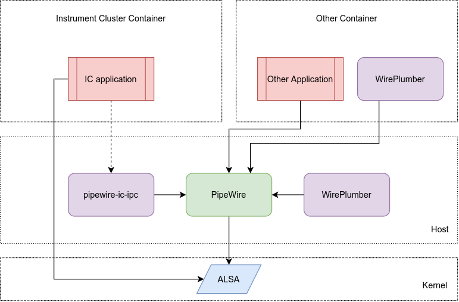
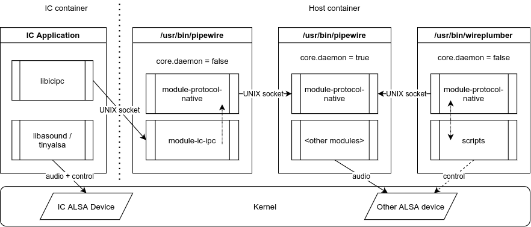
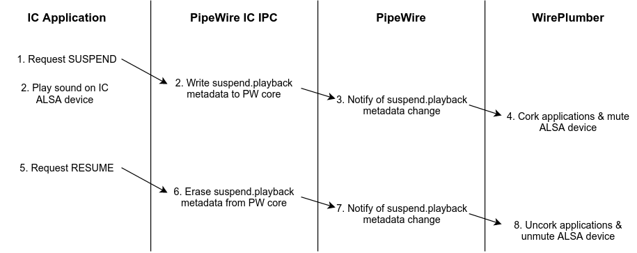

# Instrument Cluster Sound Management

## Introduction

This document describes the design of the software setup which enables the integration
of AGL’s sound system with applications running in the Instrument Cluster domain.
This software setup is specific to the case where a single system is used to implement
both the Instrument Cluster and some other domain of the vehicle, typically the
In-Vehicle-Infotainment domain, using container technology to separate them.

Applications running in the Instrument Cluster need a way to safely play important
sounds to alert the driver of conditions that need the driver’s attention. At the same
time, in a containerized environment that serves multiple vehicle domains, applications
running in other containers may be using the sound hardware to play less important sounds,
such as music, which conflicts with the IC’s need to play sound on the same hardware.

The solution developed here, for safety reasons, relies on the operating system and the
hardware itself to allow the IC applications to stream sounds to the speakers using a
dedicated device handle, while applications from other domains are all routed through a
sound server that runs on the host container and operates on a different sound device handle.

However, to achieve good inter-operation, there is need for additional software mechanisms
that will work in combination with this hardware-based solution. First of all, it is necessary
to have a mechanism that allows IC applications to pause all sounds that are being routed via
the sound server while there is an important IC sound playing and resume them afterwards.
This is so that other domain applications can be informed of this temporary pause and offer
the appropriate user experience. Secondly, it is desirable to have separation of duties
between the host and the other domain’s (non-IC) container. It should be the responsibility
of the other domain’s container to implement the sound system policy, so that the host does
not need to be aware of the exact applications that are running on this container.

## Requirements

- Single system shared between IC and at least one secondary domain (IVI, other ...)

- The domains are separated using containers

- All the containers, including the host, are running a variant of AGL

- The host OS and the secondary domain container use PipeWire and WirePlumber 
  to implement the sound system

- The sound hardware offers, on the Linux kernel driver side, a separate ALSA 
  device for sounds that belong to the IC and a separate ALSA device for other sounds

## Architectural design

The core of the sound system consists of the PipeWire daemon, which is responsible for routing
audio between the kernel and applications running in the “Other Container”.

The PipeWire session is orchestrated by a secondary daemon, WirePlumber. WirePlumber is
designed in such a way so that it can have multiple instances, for task separation.
One instance shall be running in the host container and it shall be responsible for
managing the devices that PipeWire handles as well as the security isolation between
different applications and different containers. At least one more instance shall be
running in the “Other Container” and be responsible for implementing policy mechanisms
related to the applications that are running in that container.

Further WirePlumber instances are possible to run as well. For instance, it may be desirable
to have another “policy” instance in a third container that implements another vehicle system
and shares the main PipeWire daemon from the host. Additionally, the “Other Container” may
be running a separate WirePlumber instance to manage bluetooth audio devices, which shall be
the responsibility of that container instead of the host.

To implement communication between the IC and the host, a third daemon is used: pipewire-ic-ipc.
This daemon listens on a UNIX domain socket for messages from the IC applications and offers
them the ability to pause or resume sounds that are being routed via PipeWire.

Finally, IC applications are given a library (icipc library) that allows them to send messages
to pipewire-ic-ipc on the host. This library is minimal and has no external dependencies,
for safety reasons. 

For sound playback, IC applications are expected to use the ALSA API directly and communicate
with the dedicated ALSA device that is meant for IC sounds. Arbitration of this device between
different IC applications is out of scope for this document and it is assumed to be a solved
problem.

### PipeWire-IC-IPC

This component acts as the server-side component for the UNIX socket that is used for
communication between the IC applications and the host. It is implemented as a pipewire module,
therefore it needs the `/usr/bin/pipewire` process in order to be launched. Launching happens
with a special configuration file (`pipewire-ic-ipc.conf`) which instructs this PipeWire process
to be launched as a client (`core.daemon = false`) and to load only `module-ic-ipc` together
with `module-protocol-native`. The latter enables communication with the daemon instance of
PipeWire (`core.daemon = true`), which implements the sound server.

### icipc library

The IC Application is given a library (‘libicipc’) that implements the client side of
pipewire-ic-ipc. This library allows sending two commands:

- SUSPEND
  - Asks WirePlumber (via PipeWire) to cork applications and mute the ALSA device used by PipeWire
- RESUME
  - Reverts the effects of SUSPEND

IC Applications are expected to send the SUSPEND command before starting playback of a sound
to their dedicated ALSA device. The RESUME command should be sent after playback of this IC
sound has finished. 

It should be noted that the RESUME command is also issued automatically when the IC application
disconnects from the pipewire-ic-ipc UNIX socket.

If multiple IC application issue SUSPEND to the pipewire-ic-ipc server, then only the first
SUSPEND generates actions for WirePlumber. The rest are counted and the pipewire-ic-ipc
server expects an equal number of RESUME commands before generating resume actions for
WirePlumber.

The implementation of the SUSPEND/RESUME mechanism uses PipeWire’s metadata to signal
WirePlumber. PipeWire-IC-IPC will look for the “default” metadata object in PipeWire’s list
of objects and will write the “suspend.playback” key with a value of “true” on id 0.
The metadata change is then notified to all clients. WirePlumber, being a client, gets
notified of this change and takes actions. All actions are defined in Lua scripts.

