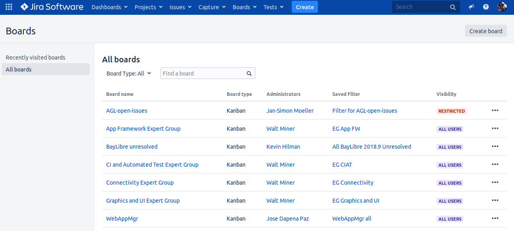
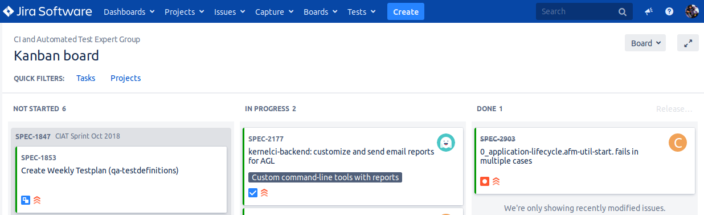

This document has been created to give further insight into the work in progress
towards the Automotive Grade Linux architecture based on the community roadmap.
The requirements for the roadmap are being tracked in
[Jira](https://jira.automotivelinux.org/).

On this page you will see all the public (and restricted) boards that have been
created. For example the **Board Name** *CI and Automated Test Expert Group*:

When you click on *CI and Automated Test Expert Group* under **Board name** you
will be directed to a page that contains the following columns:

The meanings to these columns are as follows:

-  **NOT STARTED** – list of items slated for the current sprint (sprints are
   defined in 2 week iterations), but are not currently in progress
-  **IN PROGRESS** – items currently being worked by someone in the community.
-  **DONE** – items merged and complete in the sprint.

If there is an item you are interested in working on, want more information or
have questions, or if there is an item that you feel needs to be in higher
priority, please add comments directly to the Jira item. All feedback and help
is very much appreciated.