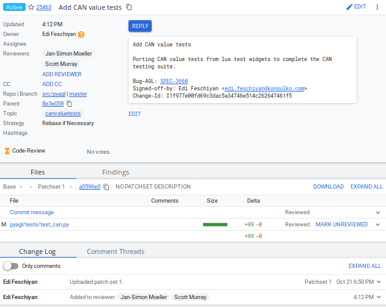

1. Click on a link for incoming or outgoing review.

2. The details of the change and its current status are loaded:

      

      -  **Status:** Displays the current status of the change.

      -  **Reply:** Click on this button after reviewing to add a final review
         message and a score, -1, 0 or +1.

      -  **Patch Sets:** If multiple revisions of a patch exist, this button
         enables navigation among revisions to see the changes. By default,
         the most recent revision is presented.

      -  **Download:** This button brings up another window with multiple
         options to download or checkout the current changeset. The button on
         the right copies the line to your clipboard. You can easily paste it
         into your git interface to work with the patch as you prefer.

         Underneath the commit information, the files that have been changed by
         this patch are displayed.

3. Click on a filename to review it. Select the code base to
   differentiate against. The default is ``Base`` and it will generally
   be what is needed.

4. The review page presents the changes made to the file. At the top of
   the review, the presentation shows some general navigation options.
   Navigate through the patch set using the arrows on the top right
   corner. It is possible to go to the previous or next file in the set
   or to return to the main change screen. Click on the yellow sticky
   pad to add comments to the whole file.

      The focus of the page is on the comparison window. The changes made are
      presented in green on the right versus the base version on the left.
      Double click to highlight the text within the actual change to provide
      feedback on a specific section of the code. Press *c* once the code is
      highlighted to add comments to that section.

5. After adding the comment, it is saved as a *Draft*.

6. Once you have reviewed all files and provided feedback, click the
   *green up arrow* at the top right to return to the main change page.
   Click the ``Reply`` button, write some final comments, and submit
   your score for the patch set. Click ``Post`` to submit the review of
   each reviewed file, as well as your final comment and score. Gerrit
   sends an email to the change-submitter and all listed reviewers.
   Finally, it logs the review for future reference. All individual
   comments are saved as *Draft* until the ``Post`` button is clicked.

